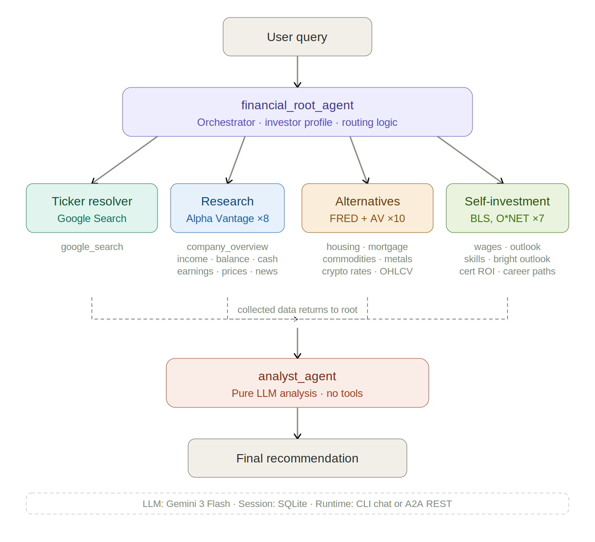

# Multi-Agent Financial AI System

**Architecture Reference Document**

Built with Google ADK (Agent Development Kit) · Gemini 3 Flash · SQLite Sessions

---

## System Overview

A multi-agent financial AI system where a root orchestrator agent routes user queries to specialized data-gathering sub-agents, then sends all collected data to an analyst agent for final recommendations. All agents run on Gemini 3 Flash. Session persistence uses SQLite. The system can run as a CLI chat interface or as an A2A (Agent-to-Agent) REST service.

The architecture follows a hub-and-spoke pattern: the root agent acts as an intelligent router that classifies incoming queries, dispatches them to the appropriate data-gathering agents, collects their results, and forwards everything to the analyst agent for synthesis and recommendation.

---

## Agent Hierarchy & Data Flow

The system comprises six agents: one orchestrator (root), four data-gathering sub-agents, and one pure-analysis agent. The root agent wraps each sub-agent as an `AgentTool` and has the investor profile injected into its system prompt for personalized routing.

---

## Agent Details

| Agent | Role | Tools | Description |
|-------|------|-------|-------------|
| `financial_root_agent` | Orchestrator | 1 | Routes queries to sub-agents based on topic. Has investor profile in system prompt. Wraps sub-agents as AgentTool. Includes `get_current_datetime` utility. |
| `ticker_resolver` | Data Gathering | 1 | Resolves company names to stock ticker symbols using Google Search. Example: "Apple" → "AAPL". |
| `research_agent` | Data Gathering | 8 | Gathers stock and company financial data via Alpha Vantage API: company overview, income statement, balance sheet, cash flow, earnings, daily/weekly prices, news sentiment. |
| `alternatives_agent` | Data Gathering | 10 | Gathers non-stock investment data. FRED API (6 tools): housing prices, median home price, mortgage rates, housing starts, inventory, permits. Alpha Vantage (4 tools): commodities, precious metals, crypto exchange rates, crypto monthly OHLCV. |
| `self_investment_agent` | Data Gathering | 7 | Gathers human capital data. BLS (2): wages, outlook. FRED (1): education economics. O\*NET (2): skills, bright outlook. Static (2): certification ROI database (12 certs), career path comparison. |
| `analyst_agent` | Analysis | 0 | Interprets all collected data and produces final recommendations. Pure LLM analysis with no tools. Specialized instructions for stocks, real estate, metals, commodities, crypto, self-investment ROI, and cross-category comparisons. |

---

## External APIs & Tools Reference

The system uses 26 data-gathering tools distributed across 4 sub-agents, plus 1 utility tool (`get_current_datetime`) on the root agent. The analyst agent has zero tools and relies entirely on LLM reasoning.

| API Source | Tools | Agent | Count |
|------------|-------|-------|-------|
| **Search & Resolution** | | | |
| Google Search | `google_search` (ticker lookup) | Ticker Resolver | 1 |
| **Stock & Company Data** | | | |
| Alpha Vantage | `company_overview`, `income_statement`, `balance_sheet`, `cash_flow`, `earnings`, `daily_prices`, `weekly_prices`, `news_sentiment` | Research | 8 |
| **Alternative Investments** | | | |
| FRED (St. Louis Fed) | `housing_prices`, `median_home_price`, `mortgage_rates`, `housing_starts`, `housing_inventory`, `building_permits` | Alternatives | 6 |
| Alpha Vantage | `commodity_prices`, `precious_metals`, `crypto_exchange_rates`, `crypto_monthly` | Alternatives | 4 |
| **Human Capital & Careers** | | | |
| BLS | `occupation_wages`, `occupation_outlook` | Self-Investment | 2 |
| FRED | `education_economics` (tuition, loans, income) | Self-Investment | 1 |
| O\*NET | `occupation_skills`, `bright_outlook_search` | Self-Investment | 2 |
| Static DB | `certification_roi` (12 certs), `career_path_compare` | Self-Investment | 2 |
| **Analysis** | | | |
| Gemini 3 Flash | LLM-only (no tool calls) | Analyst | 0 |

**Total:** 26 data-gathering tools + 1 utility tool + 1 pure-LLM analyst = 28 tool slots across 6 agents.

---

## Routing Logic

The root agent's system prompt contains routing instructions that classify user queries into one of six patterns. Each pattern activates a different combination of sub-agents before handing all collected data to the analyst.

| Query Type | Agent Flow |
|------------|------------|
| Stocks | `ticker_resolver` → `research_agent` → `analyst_agent` |
| Alternative investments | `alternatives_agent` → `analyst_agent` |
| REITs | `ticker_resolver` + `research_agent` + `alternatives_agent` → `analyst_agent` |
| Self-investment | `self_investment_agent` → `analyst_agent` |
| Human capital vs. financial | `alternatives_agent` + `self_investment_agent` → `analyst_agent` |
| Mixed portfolio | `research_agent` + `alternatives_agent` → `analyst_agent` |

### Routing Details

- **Stocks:** First resolves the company name to a ticker symbol, then gathers comprehensive financial data, then analyzes.
- **Alternative investments:** Directly routes to the alternatives agent for housing, commodities, metals, or crypto data.
- **REITs:** A hybrid route that needs both stock data (the REIT is a ticker) and housing market data for context. All three data agents fire.
- **Self-investment:** Routes to the self-investment agent for certifications, skills, career, and education data.
- **Human capital vs. financial:** Fans out to both the alternatives agent and self-investment agent in parallel, then compares asset vs. human capital ROI.
- **Mixed portfolio:** Activates research and alternatives agents together for queries spanning stocks and non-stock assets.

---

## Example Query Flows

### Example 1: Stock Analysis

**Query:** "Should I invest in Apple stock right now?"

1. `financial_root_agent` — Detects stock query, routes to ticker resolver first.
2. `ticker_resolver` — Resolves "Apple" → AAPL via Google Search.
3. `research_agent` — Fetches AAPL financials: `company_overview`, `income_statement`, `daily_prices`, `earnings`, `news_sentiment`.
4. `analyst_agent` — Synthesizes all data against investor profile → buy/hold/sell recommendation.

### Example 2: Alternative Investment

**Query:** "Is now a good time to buy gold or Bitcoin?"

1. `financial_root_agent` — Detects non-stock assets, routes to alternatives agent.
2. `alternatives_agent` — Pulls `precious_metals`, `crypto_exchange_rates`, `crypto_monthly`, `commodity_prices` from Alpha Vantage.
3. `analyst_agent` — Compares gold vs. BTC risk/return profiles → cross-category recommendation.

### Example 3: Human Capital vs. Financial Asset

**Query:** "Should I invest $5k in gold or get my GCP certification?"

1. `financial_root_agent` — Detects mixed query (financial asset + self-investment), fans out to both agents.
2. `alternatives_agent` — Fetches current gold prices and historical performance.
3. `self_investment_agent` — Pulls GCP certification ROI, salary premium data, cloud job outlook via `certification_roi`, `occupation_wages`, `occupation_outlook`, `bright_outlook_search`.
4. `analyst_agent` — Compares gold's expected return vs. GCP cert salary premium + career ROI → personalized recommendation factoring investor profile.

---

## Key Files

| File | Purpose |
|------|---------|
| `main.py` | Root agent creation, routing logic, CLI chat loop, A2A server |
| `ticker_resolver.py` | Ticker resolution agent definition |
| `research_agent.py` | Stock research agent and Alpha Vantage tools |
| `alternatives_agent.py` | Alternative investments agent (FRED + Alpha Vantage tools) |
| `self_investment_agent.py` | Self-investment/human capital agent (BLS, O\*NET, FRED, static) |
| `analyst_agent.py` | Analysis and recommendations agent (no tools) |
| `investor_profile.md` | Personalized investor context injected into root agent system prompt |

---

## Infrastructure & Runtime

- **LLM:** Google Gemini 3 Flash (all agent calls)
- **Session Persistence:** SQLite
- **Runtime Modes:** CLI chat interface or A2A (Agent-to-Agent) REST service
- **Framework:** Google ADK (Agent Development Kit)
- **Agent Pattern:** Root orchestrator with sub-agents wrapped as `AgentTool` instances
- **External Data Sources:** Google Search, Alpha Vantage, FRED, BLS, O\*NET, static certification database

---

## Architecture Design Notes

The root agent's routing logic is the critical decision point. It must correctly classify queries into one of six routing patterns, which becomes nuanced for hybrid queries like REITs (needing both ticker resolution and housing data) or mixed portfolios.

The analyst agent being tool-free is an intentional design choice. By forcing all data gathering to happen upstream, the analyst receives a complete dataset to reason over rather than cherry-picking what to look up. This separation of "gather" vs. "analyze" produces more balanced and comprehensive recommendations.

The investor profile injection into the root agent's system prompt means that routing decisions and final recommendations are personalized. The same query from different investors may trigger different analysis emphasis based on risk tolerance, portfolio goals, and investment timeline.

Alpha Vantage is the most heavily used external API, powering 12 of 26 tools across two agents (research and alternatives). Rate limit management is important given this concentration.
